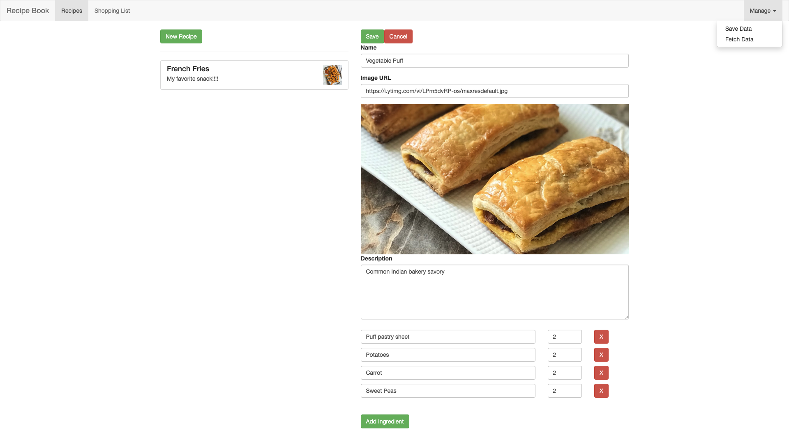
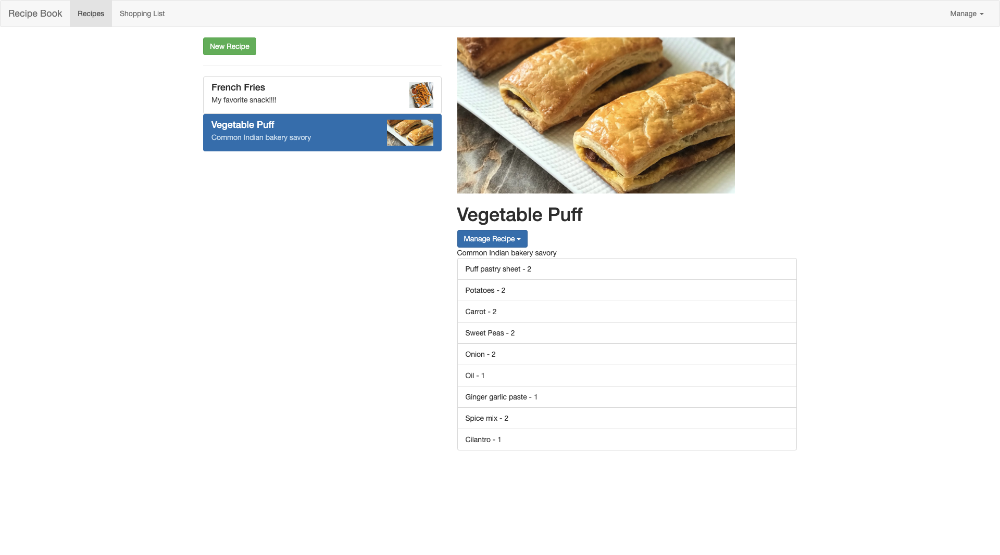
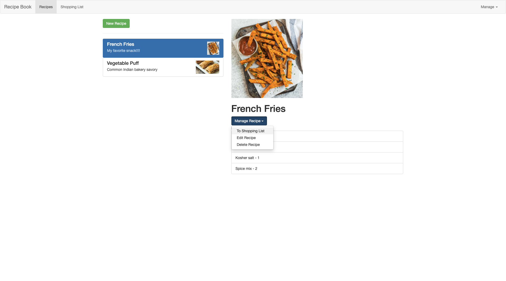
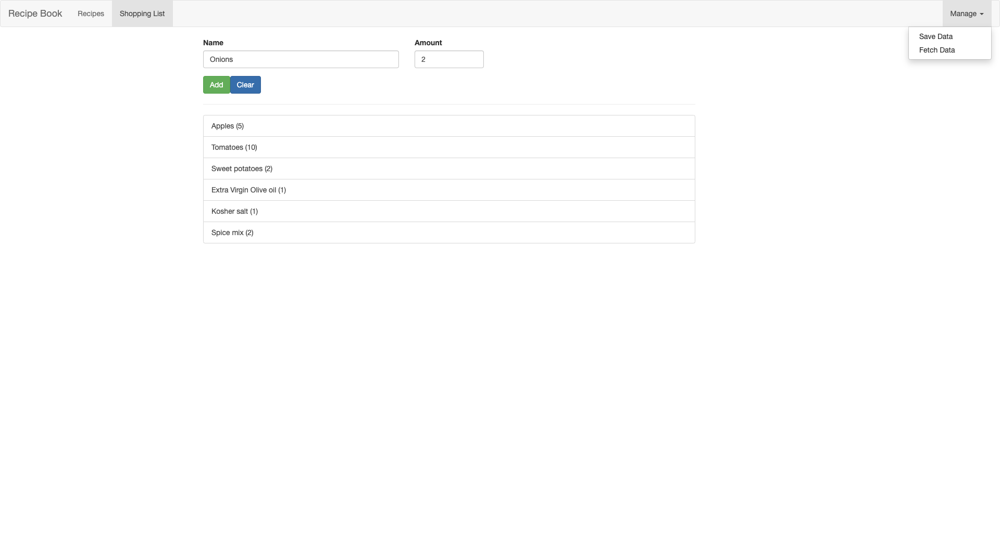
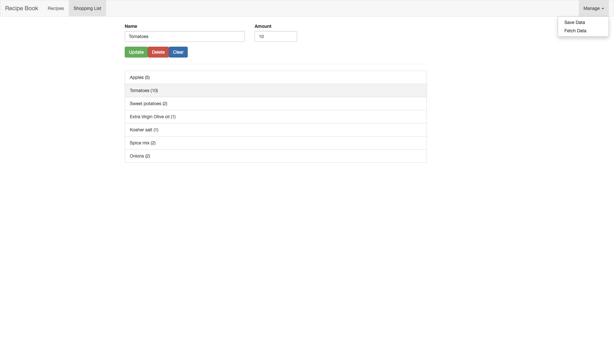

## How to use

Run `npm install` inside this project folder to install all dependencies.

Make sure you use the latest version of the CLI (upgrade guide below)

Run `ng serve` to see the app in action (try `npm start` in case `ng serve` fails).

## How to upgrade the CLI

Run the below commands - only use "sudo" on Mac/ Linux.

`sudo npm uninstall -g angular-cli @angular/cli`

`npm cache clean --force`

`sudo npm install -g @angular/cli`

## Features implemented 

### Recipe Page
#### 1. Add new recipes to your recipe book : 

Specify recipe name, image URL, ingredients and their quantities.
Functionality to save and fetch data from your system.

#### 2. View recipe:

Cick on a recipe to view your saved recipes and the corresponding ingredients.

#### 3. Manage recipe

- Edit or delete a recipe.
- Selecting the `To Shopping List` option adds all the ingredients of the recipe along with the quantity to your shopping list.

### Shopping List page

#### 1. Item List

View all the items in your shopping list from this page.

#### 2. Update List

Clicking an item in the shopping list gives ability to update, and delete the item from the shopping list.

